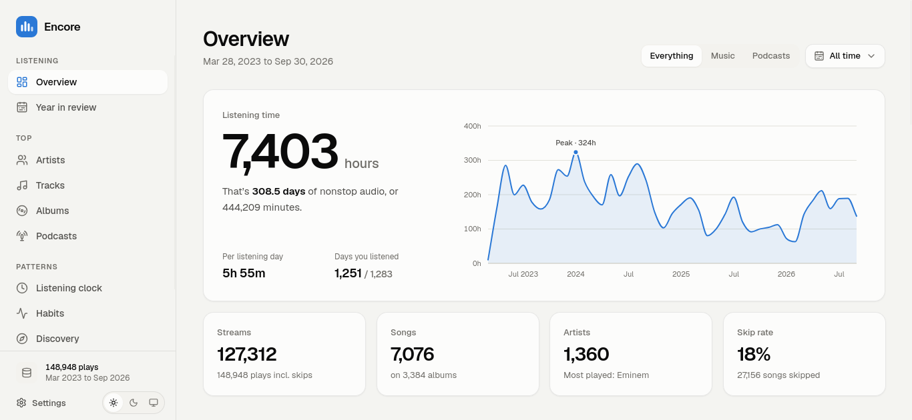

# Encore

A private, in-browser dashboard for your Spotify streaming history. Drop in the
data export Spotify emails you and explore every play: top artists, tracks and
albums, when and how you listen, streaks, eras, and a review of every year.

Nothing is uploaded. The export is unzipped and parsed in your browser, and the
results are stored in your browser's IndexedDB. Anyone can use it with their own
data.

**Try it at [encore.vitumbikochilinda.me](https://encore.vitumbikochilinda.me).**

<picture>
  <source media="(prefers-color-scheme: dark)" srcset="docs/screenshots/overview-dark.png">
  
</picture>

## Features

- **Overview**: total listening time, streams, top artists/tracks/albums, highlights
  (biggest day, longest streak, longest session, peak hour, songs on repeat).
- **Year in review**: a recap of every year in your history, compared by daily average.
- **Top artists, tracks, albums, podcasts and audiobooks**: ranked by time or streams,
  with album art, share, trend sparklines and first-listen dates. Click any name for a detail sheet.
- **Listening clock**: listening over time, time of day, day of week, a weekday × hour
  heatmap, a calendar for each year and month-by-month comparisons.
- **Habits**: skip, shuffle and offline rates over time, most/never skipped songs, how plays
  start and end, session lengths, devices and countries.
- **Discovery**: new artists and songs over time, variety, biggest discoveries, your top
  artist of every month, single-day obsessions, forgotten favourites and loyal artists.
- **History**: every play, searchable (accent-insensitive) and paginated.
- Filters for any year, recent period or custom range, and for music / podcasts / audiobooks.
- Light and dark themes that override the system setting (or follow it).
- Settings for time zone (Spotify records plays in UTC) and what counts as a stream (30 s by default).
- **Optional Spotify connection**: artist photos, your top genres, and saving your top songs, a year's
  favourites or your forgotten favourites as private playlists.
  Spotify only lets accounts the deployment's owner has approved connect (5 at most), so on someone
  else's deployment you'll usually need your own Client ID (see [Spotify connection](#spotify-connection-optional)).
  Everything else works without connecting.

Sections only appear when your export has the data for them: audiobooks, video, podcasts,
skips, devices and countries all depend on what Spotify included.

## Getting your data

1. Open [Spotify's privacy settings](https://www.spotify.com/account/privacy/) and request
   **Extended streaming history** (your whole history, with skips, devices and more).
   **Account data** also works, but only covers about the last year.
2. Wait for Spotify's email. It can take a few days, sometimes up to 30.
3. Open the app and drop in `my_spotify_data.zip`, the JSON files inside it, or the
   unzipped folder.

Supported files: `Streaming_History_Audio_*.json`, `Streaming_History_Video_*.json`, older
`endsong_*.json`, and the basic export's `StreamingHistory*.json`. When both exports are
imported together, the extended history wins for the dates it covers.

## Privacy

- Files are processed in a Web Worker on your device; there is no backend.
- IP addresses, usernames and user agents in the export are never read or stored.
- Album art comes from Spotify's public oEmbed endpoint, requested by your browser with only the item's ID.
  Turn it off in **Settings → Album art** to keep every request on your device.
- Connecting Spotify is optional and asks only for permission to create private playlists. The session
  is kept in this browser.
- Delete everything from **Settings → Your data**.

> Personal exports (`*.zip`, extracted export folders) are gitignored. Never commit real listening data.

## Development

Requires Node.js 20.9+.

```bash
npm install
npm run dev      # http://localhost:3000
npm test         # unit tests (Vitest)
npm run lint
npm run build    # static production build
```

Every route is statically prerendered, so the build can be deployed to any static or
Next.js host (for example Vercel).

### Spotify connection (optional)

Album art needs no setup. Artist photos, genres and playlists use the Spotify Web API:

1. Create an app in the [Spotify Developer Dashboard](https://developer.spotify.com/dashboard)
   (the owner needs Spotify Premium) and tick **Web API**.
2. Add redirect URIs: `http://127.0.0.1:3000/callback` for local development and
   `https://<your-domain>/callback` for your deployment. Spotify rejects `localhost`, so open
   the app at `http://127.0.0.1:3000` when testing logins locally.
3. Set the Client ID for everyone using your deployment:

   ```bash
   # .env.local (gitignored; copy .env.example)
   NEXT_PUBLIC_SPOTIFY_CLIENT_ID=your_client_id
   ```

   Anyone can also paste their own Client ID in **Settings → Spotify account**.

Spotify limits Development Mode apps to 5 users, who must be added under **User Management**
in the dashboard. Anyone else can log in but Spotify refuses their requests, so Encore signs them
out and suggests using their own Client ID. Opening the connection to everyone requires Spotify's
Extended Quota Mode, which is only granted to registered businesses with a large user base. Since February 2026 the API only allows single-item lookups, so artist details
are fetched one at a time and cached in IndexedDB for 30 days. Genres are deprecated by Spotify
and missing for many artists.

### How it works

- `lib/ingest/`: reads zips with the browser's native `DecompressionStream` (falling back to
  fflate), detects the export format, and builds a **columnar dataset**: one typed array per
  field, with names stored once in dictionaries. It de-duplicates repeated rows and runs in a
  Web Worker (`import.worker.ts`).
- `lib/storage.ts`: saves the dataset to IndexedDB (a few MB for years of history).
- `lib/prepare.ts`: derives local start time, day and hour for the chosen time zone.
  Streams are sorted by start time, so any date range is a contiguous slice.
- `lib/stats/`: pure functions over a `Scope` (data, range, content filter, stream threshold).
  Results are memoized per scope in `lib/stats/cache.ts`.
- `components/charts/`: hand-built, accessible SVG charts. Each one has keyboard navigation,
  tooltips and a table view, using a colour-blind-safe palette.
- `lib/artwork.ts`, `lib/artwork-client.ts`: pick a representative track or episode for each
  artist, album and show, then look up its cover through Spotify's oEmbed endpoint (cached).
- `lib/spotify/`: the optional Web API connection (Authorization Code with PKCE, no backend).
- `app/`: the landing page and the `/dashboard/*` pages.

### Tests

`npm test` runs unit tests for parsing (every export shape, including audiobooks, video and
the basic export), time-zone handling, the statistics, artwork lookup and the Spotify login and
API client, using synthetic fixtures in `lib/test-fixtures.ts`.

## Branches

- `main`: production.
- `preview`: staging. Feature branches (`feat/…`, `fix/…`) branch from `preview` and are merged into it
  by pull request, then `preview` is merged into `main`. Merged feature branches are deleted.

Encore isn't affiliated with Spotify. Spotify is a trademark of Spotify AB.

## License

[MIT](LICENSE)
